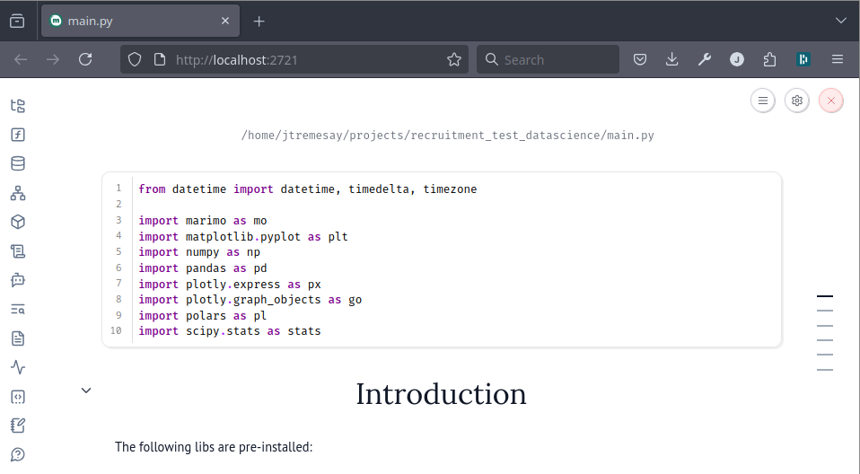

# Data scientist recruitement test

Short test to assess the knowledge and skills of a data science prospect wanting to work in the wind energy sector.

Skill assessed:

- [python](https://www.python.org/)
- [NumPy](https://numpy.org/)
- Dataframe lib (like [Pandas](https://pandas.pydata.org/))
- Ploting lib (like [Matplotlib](https://matplotlib.org/))
- Maths
- Physics
- Notebook (like [Jupyter](https://jupyter.org/))

## Instruction

Get the repository:

```shell
$ git clone https://github.com/sereema/datascience_recruitement_test.git
$ cd datascience_recruitement_test
```

### With `UV`

[uv](https://docs.astral.sh/uv/) is an extremely fast Python package and project manager than handle everything for you.
See instructions [here](https://docs.astral.sh/uv/getting-started/installation/) for installing it.

```shell
# Create the virtual env and install the dependencies
$ uv sync

# Run the notebook
$ uv run marimo edit main.py
```

### Without `uv`

```shell
# Create a virtual env
$ python3 -m venv venv

# Activate the virtual env
$ source venv/bin/activate

# Install the dependencies
$ pip install .

# Run the noteboo.
$ marimo edit main.py
```

### Have fun!

Marimo should automatically open the notebook on you browser. Have fun!

